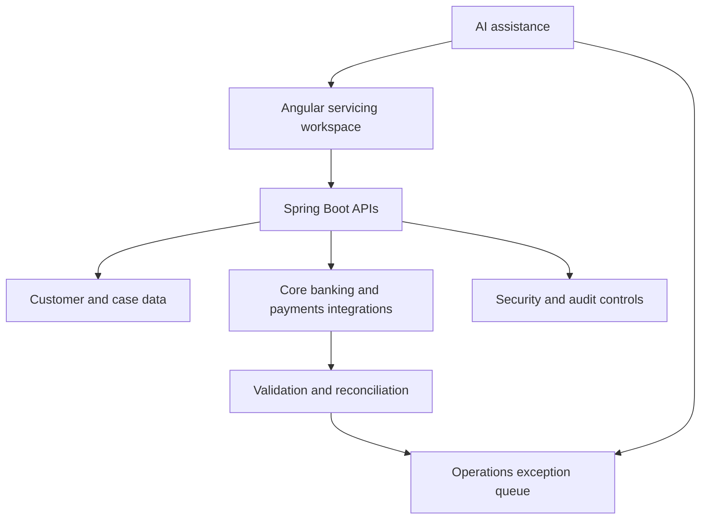

# First Horizon Bank — Senior Software Engineer Projects

**Company:** First Horizon Bank  
**Role period:** July 2022–Present  
**Primary tracks:** Full Stack, Enterprise, Frontend, Data, Security, AI

## Company and Project Context

First Horizon is a large regional financial-services organization serving consumer and business customers across the southeastern United States. Its digital products support account management, transfers, bill payments, mobile deposits, cards, alerts, and related banking operations. Customer servicing, system integration, data integrity, security, and auditability are therefore central concerns across these projects.

References:

- [First Horizon overview](https://en.wikipedia.org/wiki/First_Horizon_Bank)
- [First Horizon Mobile Banking](https://play.google.com/store/apps/details?id=com.firsttennessee.mbanking)

> **Accuracy note:** The AI capabilities and any technologies not used in the actual role should be presented as delivered work only if they can be supported in an interview. Otherwise, describe them as designed, prototyped, proposed, or planned.

---

## 1. Customer Servicing and Intelligent Case Management Workspace

**Role:** Senior Full-Stack Software Engineer  
**Tracks:** Full Stack, Enterprise, Frontend, AI

### Project Description

Designed and developed a centralized customer-servicing workspace used by branch representatives and support teams to manage customer profiles, account inquiries, service requests, supporting documents, and internal cases from a single application.

Before this platform, employees could need to move between multiple systems to review customer information, understand prior interactions, submit requests, and track outstanding work. The workspace consolidated those activities into guided Angular workflows backed by Spring Boot services.

The platform presented a unified view of customer relationships, accounts, recent requests, case history, notes, documents, and task status. Staff could create cases for address changes, account-maintenance requests, payment investigations, document requests, access problems, and other servicing activities. Workflow rules routed cases to the correct operations queue based on request type, customer segment, risk level, and required approval.

### AI-Powered Functionality

Added an AI-assisted servicing capability to help employees understand and process cases more efficiently:

- Generated concise case summaries from customer notes, prior interactions, and case events.
- Recommended case categories, routing queues, and next actions.
- Used retrieval-augmented generation to answer employee questions from approved procedures and internal knowledge articles.
- Suggested response drafts while requiring an employee to review and approve them.
- Applied PII masking, role-based access, prompt filtering, source citations, and audit logging.
- Prevented the model from directly approving transactions or changing customer records.

This approach keeps AI within an assistive role: employees make the final decision, while deterministic services remain responsible for authorization and record changes.

### Senior-Level Engineering Responsibilities

- Designed the domain model and REST API contracts for customers, accounts, cases, comments, documents, tasks, and case-status transitions.
- Built modular Spring Boot services using Spring MVC, Spring Data JPA, Hibernate, and PostgreSQL.
- Established clear boundaries between customer-profile, servicing, workflow, document, and notification capabilities.
- Developed Angular pages using reusable components, reactive forms, RxJS streams, route guards, and centralized error handling.
- Introduced Redis caching for frequently accessed reference data and selected customer-summary information.
- Designed optimistic-locking and concurrency controls to prevent employees from overwriting one another's case updates.
- Planned Flyway migrations using backward-compatible expand-and-contract patterns.
- Implemented validation, pagination, filtering, correlation IDs, structured logs, metrics, and health checks.
- Integrated S3 for controlled document storage and EC2-hosted services through environment-specific configurations.
- Reviewed API designs, database changes, pull requests, and production-readiness plans.
- Worked with product owners, operations staff, QA engineers, security teams, and architects to refine requirements.

### Technologies and Skills

Java 17, Spring Boot, Spring MVC, Spring Data JPA, Hibernate, REST APIs, Angular, TypeScript, RxJS, PostgreSQL, Redis, Flyway, AWS EC2, AWS S3, Docker, GitHub Actions, OpenAPI, OAuth 2.0/OIDC, RBAC, JUnit 5, Mockito, Testcontainers, AI/LLM integration, RAG, prompt security, PII protection, observability, system design, code reviews, and technical leadership.

### Resume-Ready Version

> Architected and delivered a centralized customer-servicing and case-management workspace using Java 17, Spring Boot, Angular, PostgreSQL, and Redis, enabling branch and support teams to manage customer profiles, account-service requests, documents, and internal cases through one application. Designed versioned REST APIs, workflow state transitions, role-based access controls, audit trails, concurrency protection, and backward-compatible Flyway migrations. Introduced an AI-assisted case copilot that summarized case history, recommended routing and next actions, and retrieved answers from approved operating procedures with citations, PII safeguards, and mandatory human review.

---

## 2. Core Banking, Payments and Intelligent Reconciliation Platform

**Role:** Senior Backend/Integration Engineer  
**Tracks:** Enterprise, Data, Full Stack, AI

### Project Description

Designed and implemented an integration platform connecting three systems responsible for core banking information, payment processing, and customer notifications.

The platform exchanged customer, account, payment, transaction-status, and notification data using REST APIs and scheduled jobs. It normalized different source-system formats into a canonical internal model and applied validation before records entered downstream processing.

Because payment systems can time out after accepting a request, the solution could not safely treat every retry as a new transaction. Idempotency keys, unique database constraints, request fingerprints, and duplicate-detection rules ensured that retries did not create duplicate payment or notification records.

Reconciliation jobs compared internal records with source and destination systems, identified missing or inconsistent transactions, and placed unresolved items into an operations queue. The platform reduced records requiring manual reconciliation from **6% to 2% over three months**.

### AI-Powered Functionality

Developed an AI-assisted reconciliation capability for cases that could not be resolved by deterministic rules:

- Used anomaly scoring to prioritize unusual mismatches based on amount, timing, status transitions, duplicate patterns, and historical resolution behavior.
- Generated plain-language explanations describing why a transaction had been flagged.
- Recommended likely resolution categories and supporting evidence for operations analysts.
- Extracted structured information from unstructured error descriptions and integration messages.
- Captured analyst feedback to evaluate recommendation quality and improve future classification.

Rules remained the authoritative mechanism for posting, reversing, or changing transactions. AI recommendations were advisory and required human approval.

### Senior-Level Engineering Responsibilities

- Defined canonical data models and versioned contracts across three independent banking systems.
- Designed resilient API clients with timeouts, exponential backoff, circuit breakers, bulkheads, and controlled retries.
- Implemented idempotent processing using idempotency keys, database constraints, and request-hash validation.
- Built scheduled reconciliation jobs with checkpointing, restartability, batch control, and exception queues.
- Established validation rules for account identifiers, monetary amounts, transaction dates, currency, and status transitions.
- Designed transaction boundaries to prevent partially processed records.
- Added dead-letter handling and operational replay procedures for failed messages or API calls.
- Created reconciliation dashboards and structured logs using end-to-end correlation identifiers.
- Tuned PostgreSQL queries, indexes, and batch sizes to improve processing efficiency.
- Led failure-mode reviews covering downstream outages, late responses, partial success, duplicated messages, and out-of-order events.
- Coordinated contract testing and release sequencing with owners of all three connected systems.

### Technologies and Skills

Java 17, Spring Boot, Spring Batch or scheduled processing, REST APIs, PostgreSQL, JPA/Hibernate, Resilience4j, OpenAPI, JSON schema validation, idempotency patterns, duplicate detection, data reconciliation, anomaly detection, AI-assisted classification, Docker, AWS, GitHub Actions, JUnit 5, Mockito, WireMock, Testcontainers, contract testing, performance tuning, observability, distributed-system design, and incident analysis.

### Resume-Ready Version

> Designed a resilient integration and reconciliation platform connecting three core banking, payment, and notification systems through REST APIs and restartable scheduled jobs. Implemented canonical data models, idempotency controls, duplicate detection, validation, retry and circuit-breaker policies, exception queues, and automated reconciliation, reducing records requiring manual reconciliation from 6% to 2% in three months. Added AI-assisted anomaly prioritization and resolution recommendations with explainable evidence and human approval, while keeping transaction posting and correction under deterministic business rules.

---

## 3. Account Service Request Forms and Workflow Modernization

**Role:** Senior Frontend/Full-Stack Engineer  
**Tracks:** Frontend, Full Stack

### Project Description

Modernized complex account-service forms used by employees to submit customer maintenance and servicing requests. The previous experience contained repeated fields, late validation, and unnecessary manual entry, increasing handling time and the likelihood of incomplete requests.

Built a configuration-driven Angular form framework with reusable controls for customer identity, account selection, addresses, contact information, request reasons, disclosures, attachments, and approvals. Customer and account details already available to the employee were prepopulated, while conditional sections appeared only when required.

Validation was performed at both the field and business-rule levels. Users received immediate, accessible guidance instead of discovering errors after submitting an entire form. Draft preservation protected work during navigation or recoverable session interruptions.

Usability testing with 15 representative users showed that median completion time fell from **7 minutes to 4 minutes**, a reduction of approximately **43%**.

### Senior-Level Engineering Responsibilities

- Designed a reusable Angular component library and configuration-driven form architecture.
- Used typed reactive forms and RxJS to coordinate dependent fields, asynchronous validation, and API requests.
- Created shared components for customer search, account selection, address entry, attachments, confirmation, and error summaries.
- Implemented debouncing, request cancellation, loading states, and centralized API-error handling.
- Applied responsive design and accessibility practices, including keyboard navigation, focus management, semantic labels, and screen-reader-friendly validation.
- Built draft-save and restore functionality without retaining unnecessary sensitive information in browser storage.
- Defined frontend coding standards and reviewed component and state-management designs.
- Instrumented workflow events to identify abandonment points and measure task completion time.
- Collaborated with users and product designers during usability testing and incorporated findings into subsequent iterations.
- Added unit, integration, and end-to-end tests for conditional forms and critical submission paths.

### Technologies and Skills

Angular, TypeScript, RxJS, reactive forms, reusable component libraries, HTML5, CSS/SCSS, responsive design, WCAG accessibility, frontend architecture, API integration, usability testing, analytics instrumentation, Jest/Jasmine, Angular Testing Library, Cypress or Playwright, CI/CD, code review, and mentoring.

### Resume-Ready Version

> Led the modernization of account-service request workflows using Angular, TypeScript, RxJS, and a reusable configuration-driven form library. Introduced prepopulated customer data, conditional sections, inline and asynchronous validation, accessible error handling, draft recovery, and responsive layouts. Instrumented the workflow and conducted usability testing with 15 users, reducing median request-completion time from 7 to 4 minutes.

---

## 4. Authentication, Authorization, Audit and Delivery Controls

**Role:** Senior Full-Stack Software Engineer  
**Tracks:** Security, Platform, Full Stack

### Project Description

Implemented security, auditability, automated testing, and delivery controls across the customer-servicing and onboarding applications.

The solution integrated enterprise identity with OAuth 2.0 and OpenID Connect. Role- and permission-based authorization restricted access to customer data and servicing actions according to employee responsibilities. Backend authorization was enforced independently of frontend controls so that restricted operations could not be accessed by directly calling an API.

Security-sensitive activities—including customer searches, record access, case assignment, field changes, document access, approval decisions, and administrative actions—produced immutable audit events. Audit records captured the actor, action, timestamp, affected resource, correlation identifier, and permitted before-and-after values while excluding passwords, tokens, and unnecessary sensitive data.

Automated build and deployment workflows standardized compilation, testing, container creation, migration validation, security checks, and release packaging. These improvements reduced deployment preparation from **45 minutes to 15 minutes**, a **67% reduction**.

### Senior-Level Engineering Responsibilities

- Integrated enterprise authentication using OAuth 2.0/OIDC and Spring Security.
- Designed RBAC and fine-grained authorization policies for servicing agents, supervisors, operations specialists, and administrators.
- Applied least-privilege access, secure session handling, secrets management, and sensitive-data masking.
- Designed searchable, tamper-resistant audit events for regulated workflows.
- Built a layered test strategy with JUnit 5, Mockito, Spring Boot integration tests, Testcontainers, and API contract tests.
- Added tests for authorization boundaries, workflow transitions, database migrations, duplicate requests, and third-party failures.
- Containerized services with Docker and standardized environment configuration.
- Created GitHub Actions pipelines for build, test, dependency scanning, container packaging, and deployment preparation.
- Added Flyway migration checks and release gates to reduce database-deployment risk.
- Established operational dashboards, alerts, trace/correlation IDs, and troubleshooting runbooks.
- Led production incident investigations using logs, audit events, database evidence, and reproducible test cases.
- Coordinated fixes with operations teams and confirmed remediation before release.

### Technologies and Skills

Java 17, Spring Boot, Spring Security, OAuth 2.0, OpenID Connect, JWT, RBAC, Angular route guards, audit logging, PostgreSQL, Flyway, JUnit 5, Mockito, Testcontainers, WireMock, Docker, GitHub Actions, AWS EC2, AWS S3, CI/CD, dependency and container scanning, structured logging, metrics, distributed tracing, incident response, release management, and secure software-development practices.

### Resume-Ready Version

> Designed authentication, authorization, audit, testing, and delivery controls for customer-servicing and onboarding applications using Spring Security, OAuth 2.0/OIDC, RBAC, PostgreSQL, Docker, and GitHub Actions. Built tamper-resistant audit trails, backend-enforced permissions, migration validation, automated integration tests, security gates, observability, and incident-response runbooks. Standardized the release workflow and reduced deployment preparation time from 45 to 15 minutes.

---

## How the Projects Work Together

- **Project 1** is the main employee-facing workspace.
- **Project 2** supplies reliable information from banking and payment systems.
- **Project 3** provides the reusable, efficient request-entry experience.
- **Project 4** protects the entire platform and makes releases repeatable.
- AI assists case workers and reconciliation analysts but does not autonomously execute regulated banking decisions.

## Interview and Resume Guidance

Do not present suggested AI features, architecture decisions, or tools such as Resilience4j, OIDC, Playwright, or a specific AI platform as completed work unless you can explain exactly how you used them. If they were not production features, use accurate language such as:

- **Designed** for a completed technical design.
- **Prototyped** for a working proof of concept.
- **Proposed** for a reviewed recommendation.
- **Planned** for roadmap work not yet implemented.
- **Delivered** only for functionality released to its intended users.
